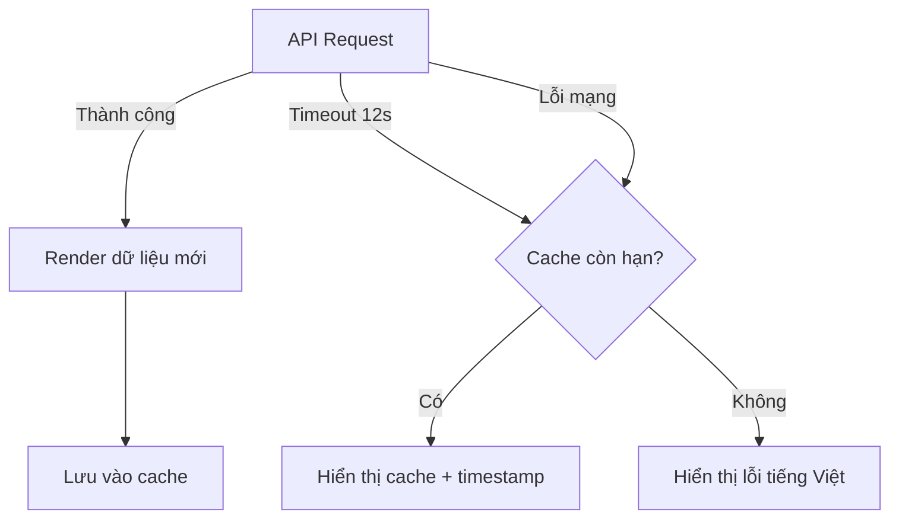

# Tài liệu Thiết kế — Nâng cấp Legacy Frame

## Tổng quan

Dự án nâng cấp Legacy Frame nhằm refactor ứng dụng dashboard single-page HTML (~2615 dòng trong `index.html`) thành kiến trúc module hóa, tối ưu hiệu năng cho thiết bị cũ (iOS < 10, Android < 5, Chrome < 40), và mở rộng nội dung thông tin cho người dùng Việt Nam.

### Phạm vi thay đổi chính

1. **Tách mã nguồn**: Từ 1 file monolithic sang cấu trúc multi-file (CSS riêng, JS theo module chức năng)
2. **Tối ưu hiệu năng**: Giảm DOM reflow, dùng `requestAnimationFrame`, lazy-load, cache API
3. **Responsive layout**: Sửa lỗi hiển thị trên mọi kích thước từ 320px đến 1920px
4. **Mở rộng nội dung**: Tiết khí, giờ hoàng đạo, vàng SJC, dự báo 3 ngày, lịch vạn niên
5. **Cải thiện hệ thống**: Settings nhóm section, xuất/nhập cài đặt, offline handling, multi-source news

### Ràng buộc kỹ thuật

- **ES5 only**: `var`, `function`, không dùng `let/const/arrow/template literals/Promise/async-await`
- **Không dùng**: CSS Grid, CSS Variables, `clamp()`, `fetch()`
- **Bắt buộc**: `-webkit-` prefix cho flexbox/transition/transform/animation/filter
- **API calls**: `XMLHttpRequest` với timeout 12 giây
- **Deploy**: Netlify (static files trong `public/`, serverless functions trong `functions/`)

## Kiến trúc

### Kiến trúc hiện tại

```
public/
  index.html          # ~2615 dòng: HTML + inline CSS (~1080 dòng) + inline JS (~800 dòng)
  amlich.js           # Thư viện lịch âm (Hồ Ngọc Đức) - ES6 class syntax
functions/
  weather.js          # Netlify serverless function (proxy Open-Meteo API)
netlify.toml          # Cấu hình Netlify
```

### Kiến trúc mới

```
public/
  index.html          # Chỉ HTML structure + thẻ tải tài nguyên
  css/
    styles.css        # Toàn bộ CSS (tách từ inline)
  js/
    app.js            # Entry point: init, legacy detection, settings load
    clock.js          # Đồng hồ, cập nhật thời gian
    calendar.js       # Lịch âm dương, thuật toán Hồ Ngọc Đức, tiết khí, giờ hoàng đạo
    weather.js        # Thời tiết hiện tại + dự báo 3 ngày
    finance.js        # USD/VND, vàng thế giới, vàng SJC, xu hướng ▲▼
    news.js           # News ticker multi-source, RSS parsing
    settings.js       # Bảng cài đặt, localStorage, xuất/nhập base64
    slideshow.js      # Ảnh nền, preload, fade transition
    disaster.js       # GDACS alerts, lọc Đông Nam Á
    quotes.js         # Ca dao, tục ngữ (50+ câu phân loại chủ đề)
    utils.js          # makeRequest (XHR wrapper), DOM helpers, cache helpers
  amlich.js           # Giữ nguyên (thư viện bên ngoài)
functions/
  weather.js          # Giữ nguyên
netlify.toml
```

### Sơ đồ kiến trúc

```mermaid
graph TB
    subgraph "Browser (ES5)"
        HTML[index.html<br/>HTML structure only]
        CSS[css/styles.css]
        
        subgraph "JavaScript Modules (ES5, script tags)"
            UTILS[utils.js<br/>XHR, DOM helpers, cache]
            APP[app.js<br/>Init, legacy detect]
            CLOCK[clock.js]
            CAL[calendar.js<br/>Âm lịch, tiết khí, giờ hoàng đạo]
            WEATHER[weather.js<br/>Hiện tại + 3 ngày]
            FINANCE[finance.js<br/>USD/VND, vàng TG, SJC]
            NEWS[news.js<br/>Multi-source RSS]
            SETTINGS[settings.js<br/>localStorage, export/import]
            SLIDE[slideshow.js<br/>Preload, fade]
            DISASTER[disaster.js<br/>GDACS, lọc ĐNA]
            QUOTES[quotes.js<br/>50+ câu, phân loại]
        end
    end
    
    subgraph "External APIs"
        WTTR[wttr.in<br/>Thời tiết]
        IPAPI[ip-api.com<br/>Geolocation]
        ERAPI[open.er-api.com<br/>Tỷ giá USD]
        GOLDAPI[freegoldapi.com<br/>Giá vàng TG]
        AQI_API[open-meteo.com<br/>AQI]
        GDACS[gdacs.org<br/>Thiên tai]
        RSS[allorigins.win<br/>RSS Proxy]
        PICSUM[picsum.photos<br/>Ảnh online]
    end
    
    subgraph "Netlify"
        FUNC[functions/weather.js<br/>Open-Meteo proxy]
    end
    
    APP --> UTILS
    CLOCK --> UTILS
    CAL --> UTILS
    WEATHER --> UTILS
    FINANCE --> UTILS
    NEWS --> UTILS
    SETTINGS --> UTILS
    SLIDE --> UTILS
    DISASTER --> UTILS
    
    WEATHER --> WTTR
    WEATHER --> IPAPI
    FINANCE --> ERAPI
    FINANCE --> GOLDAPI
    WEATHER --> AQI_API
    DISASTER --> GDACS
    NEWS --> RSS
    SLIDE --> PICSUM
```



### Chiến lược tải module

Vì phải dùng ES5 (không có ES modules), các file JS sẽ được tải theo thứ tự dependency qua `<script>` tags:

```html
<!-- Thư viện bên ngoài -->
<script src="amlich.js"></script>
<!-- Utils trước (các module khác phụ thuộc) -->
<script src="js/utils.js"></script>
<!-- Các module độc lập -->
<script src="js/clock.js"></script>
<script src="js/calendar.js"></script>
<script src="js/weather.js"></script>
<script src="js/finance.js"></script>
<script src="js/news.js"></script>
<script src="js/slideshow.js"></script>
<script src="js/disaster.js"></script>
<script src="js/quotes.js"></script>
<script src="js/settings.js"></script>
<!-- Entry point cuối cùng -->
<script src="js/app.js"></script>
```

Các module giao tiếp qua một global namespace object `LF` (Legacy Frame):

```javascript
// utils.js
var LF = LF || {};
LF.utils = { makeRequest: function(url, cb, timeout) { ... }, cache: { ... } };

// clock.js
LF.clock = { init: function() { ... }, update: function() { ... } };
```

## Thành phần và Giao diện

### 1. utils.js — Tiện ích dùng chung

```javascript
var LF = LF || {};
LF.utils = {
    /**
     * XHR wrapper với timeout
     * @param {string} url
     * @param {function} callback - function(err, data)
     * @param {number} timeoutMs - mặc định 12000
     */
    makeRequest: function(url, callback, timeoutMs) { },
    
    /**
     * Cache API response vào localStorage với TTL
     * @param {string} key
     * @param {*} data
     * @param {number} ttlMs - thời gian sống (ms)
     */
    cacheSet: function(key, data, ttlMs) { },
    
    /**
     * Đọc cache, trả null nếu hết hạn
     * @param {string} key
     * @returns {*|null}
     */
    cacheGet: function(key) { },
    
    /**
     * Tạo DocumentFragment từ mảng elements
     * @param {Array} elements
     * @returns {DocumentFragment}
     */
    createFragment: function(elements) { },
    
    /**
     * Phát hiện thiết bị cũ qua User-Agent
     * @returns {boolean}
     */
    isLegacyDevice: function() { },
    
    /**
     * Batch DOM updates - gom nhiều thay đổi vào 1 reflow
     * @param {function} updateFn
     */
    batchUpdate: function(updateFn) { }
};
```

### 2. clock.js — Đồng hồ

```javascript
LF.clock = {
    lastTime: { h: '', m: '', s: '' },
    
    /** Khởi tạo đồng hồ, bắt đầu interval 1 giây */
    init: function() { },
    
    /** Cập nhật hiển thị giờ:phút:giây, chỉ thay đổi DOM khi giá trị thay đổi */
    update: function() { },
    
    /** Bật/tắt hiển thị giây */
    toggleSeconds: function(visible) { }
};
```

### 3. calendar.js — Lịch âm dương + Vạn niên

```javascript
LF.calendar = {
    /** Chuyển đổi dương lịch sang âm lịch (thuật toán Hồ Ngọc Đức) */
    solarToLunar: function(dd, mm, yy) { },
    
    /** Lấy tiết khí (Solar Term) của ngày */
    getSolarTerm: function(dd, mm, yy) { },
    
    /** Lấy giờ hoàng đạo của ngày (danh sách khung giờ tốt) */
    getLuckyHours: function(dd, mm, yy) { },
    
    /** Lấy hướng xuất hành tốt theo ngày */
    getGoodDirection: function(dayCanChi) { },
    
    /** Lấy thông tin vạn niên tóm tắt cho ngày */
    getDaySummary: function(dd, mm, yy) { },
    
    /** Kiểm tra ngày lễ (cả dương lịch và âm lịch) */
    getHoliday: function(dd, mm, yy, lunarDay, lunarMonth) { },
    
    /** Render lịch tuần (landscape) hoặc tháng (portrait) */
    render: function(baseDate) { },
    
    /** Cập nhật hiển thị ngày trên dashboard */
    updateMainDate: function() { }
};
```

### 4. weather.js — Thời tiết

```javascript
LF.weather = {
    /** Tải thời tiết hiện tại qua wttr.in */
    loadCurrent: function() { },
    
    /** Tải dự báo 3 ngày tới (nhiệt độ cao/thấp, mô tả) */
    loadForecast: function() { },
    
    /** Tải AQI từ open-meteo */
    loadAQI: function() { },
    
    /** Áp dụng dữ liệu thời tiết lên DOM */
    applyWeatherData: function(city, info, tempC) { },
    
    /** Map weather code sang mô tả tiếng Việt + icon */
    getWeatherInfo: function(code) { }
};
```

### 5. finance.js — Tài chính

```javascript
LF.finance = {
    previousValues: { usd: null, goldWorld: null, goldSJC: null },
    
    /** Tải tỷ giá USD/VND */
    loadUSD: function() { },
    
    /** Tải giá vàng thế giới quy đổi VND/lượng */
    loadGoldWorld: function() { },
    
    /** Tải giá vàng SJC trong nước */
    loadGoldSJC: function() { },
    
    /** Tính xu hướng tăng/giảm so với lần trước */
    getTrend: function(current, previous) { },
    
    /** Render widget tài chính với xu hướng ▲▼ */
    render: function() { }
};
```

### 6. news.js — Tin tức

```javascript
LF.news = {
    sources: [
        { name: 'VnExpress', url: '...' },
        { name: 'Tuổi Trẻ', url: '...' },
        { name: 'Dân Trí', url: '...' },
        { name: 'Báo Chính Phủ', url: '...' },
        { name: 'VTV News', url: '...' }
    ],
    
    /** Tải tin từ nhiều nguồn đồng thời */
    loadMultiSource: function() { },
    
    /** Parse RSS XML thành mảng items */
    parseRSS: function(xmlString, sourceName) { },
    
    /** Build DOM cho ticker (dùng DocumentFragment) */
    buildTickerDOM: function(items) { },
    
    /** Animation ticker bằng requestAnimationFrame */
    startAnimation: function() { },
    
    /** Tự động refresh mỗi 15 phút */
    scheduleRefresh: function() { }
};
```

### 7. settings.js — Cài đặt

```javascript
LF.settings = {
    defaults: { /* tất cả giá trị mặc định */ },
    current: {},
    
    /** Tải settings từ localStorage */
    load: function() { },
    
    /** Lưu settings vào localStorage (< 100ms) */
    save: function() { },
    
    /** Áp dụng settings lên DOM */
    apply: function() { },
    
    /** Đặt lại về mặc định (có dialog xác nhận) */
    reset: function() { },
    
    /** Xuất settings thành chuỗi base64 */
    exportSettings: function() { },
    
    /** Nhập settings từ chuỗi base64 */
    importSettings: function(base64String) { },
    
    /** Kiểm tra localStorage khả dụng */
    isStorageAvailable: function() { }
};
```

### 8. slideshow.js — Ảnh nền

```javascript
LF.slideshow = {
    images: [],
    currentIndex: 0,
    preloadedImage: null,
    
    /** Khởi tạo slideshow */
    init: function() { },
    
    /** Preload ảnh tiếp theo */
    preloadNext: function() { },
    
    /** Chuyển ảnh với fade transition 1.5s */
    changeImage: function() { },
    
    /** Chọn kích thước Picsum theo viewport */
    getPicsumSize: function() { },
    
    /** Bắt đầu/dừng slideshow */
    start: function(intervalMs) { },
    stop: function() { }
};
```

### 9. disaster.js — Cảnh báo thiên tai

```javascript
LF.disaster = {
    /** Tải alerts từ GDACS, lọc Đông Nam Á */
    load: function() { },
    
    /** Lọc events theo khu vực ĐNA/VN (lat/lon bounding box) */
    filterSEAsia: function(events) { },
    
    /** Render banner cảnh báo */
    renderBanner: function(events) { },
    
    /** Xóa banner */
    removeBanner: function() { }
};
```

### 10. quotes.js — Ca dao, tục ngữ

```javascript
LF.quotes = {
    /** Bộ sưu tập 50+ câu, phân loại theo chủ đề */
    collection: [
        { text: '...', author: '...', category: 'gia-dinh' },
        // ...
    ],
    
    /** Hiển thị câu ngẫu nhiên */
    showRandom: function() { },
    
    /** Đổi câu mới (gọi định kỳ) */
    rotate: function() { }
};
```

## Mô hình Dữ liệu

### Settings Object

```javascript
var settings = {
    // Hiển thị
    powerSaveMode: false,       // boolean - chế độ tiết kiệm điện
    clockOnlyMode: false,       // boolean - chế độ nhìn xa
    clockOnlyShowGregorian: false,
    clockOnlyShowLunar: false,
    clockOnlyShowWeather: false,
    secondsVisible: false,
    
    // Thành phần ẩn/hiện
    slideshowHidden: false,
    dateHidden: false,
    calendarHidden: false,
    weatherHidden: false,
    quoteHidden: false,
    aqiHidden: true,            // mặc định ẩn
    showFinanceWidget: true,
    showDisasterAlerts: false,
    showNewsTicker: true,
    
    // Nguồn ảnh
    useOnlinePhotos: false,
    slideshowInterval: 12000,   // MỚI: 10000|15000|30000|60000 ms
    
    // Tin tức
    newsSourceIndex: 0,         // THAY ĐỔI: giờ hỗ trợ multi-source
    newsMultiSource: true       // MỚI: tải từ nhiều nguồn
};
```

### API Cache Structure (localStorage)

```javascript
// Key format: "lf_cache_{type}"
// Value format: { data: ..., ts: timestamp, ttl: milliseconds }

// Ví dụ:
{
    "lf_cache_weather": {
        "data": { "city": "Hà Nội", "temp": 28, "code": "116", "forecast": [...] },
        "ts": 1700000000000,
        "ttl": 1800000  // 30 phút
    },
    "lf_cache_finance": {
        "data": { "usd": 25400, "goldWorld": 85.5, "goldSJC": 92.0 },
        "ts": 1700000000000,
        "ttl": 1800000
    },
    "lf_cache_news": {
        "data": [{ "title": "...", "link": "...", "source": "VnExpress" }],
        "ts": 1700000000000,
        "ttl": 900000   // 15 phút
    },
    "lf_cache_aqi": {
        "data": { "value": 42, "level": "Tốt" },
        "ts": 1700000000000,
        "ttl": 1800000
    }
}
```

### Lunar Calendar Data Model

```javascript
// Kết quả từ calendar.solarToLunar()
{
    day: 15,
    lunarMonth: 8,
    lunarYear: 2024,
    isLeap: false,
    dayCanChi: "Giáp Tý",
    monthCanChi: "Quý Dậu",
    yearName: "Giáp Thìn",
    monthName: "tháng 8",
    holiday: "Tết Trung Thu"
}

// MỚI: Kết quả từ calendar.getDaySummary()
{
    dayCanChi: "Giáp Tý",
    monthCanChi: "Quý Dậu",
    yearCanChi: "Giáp Thìn",
    solarTerm: "Thu Phân",          // tiết khí
    luckyHours: ["Tý", "Sửu", "Mão", "Ngọ", "Thân", "Dậu"],  // giờ hoàng đạo
    goodDirection: "Đông Nam",       // hướng xuất hành
    holiday: "Tết Trung Thu"
}
```

### Finance Data Model

```javascript
// Kết quả render finance widget
{
    usd: {
        value: 25400,
        trend: "up",        // "up" | "down" | "stable"
        trendSymbol: "▲",   // "▲" | "▼" | ""
        lastUpdate: 1700000000000
    },
    goldWorld: {
        value: 85.5,        // triệu VND/lượng
        trend: "down",
        trendSymbol: "▼",
        lastUpdate: 1700000000000
    },
    goldSJC: {              // MỚI
        value: 92.0,        // triệu VND/lượng
        trend: "up",
        trendSymbol: "▲",
        lastUpdate: 1700000000000
    }
}
```

### Weather Forecast Model

```javascript
// MỚI: Dự báo 3 ngày
{
    current: {
        city: "Hà Nội",
        temp: 28,
        icon: "🌥️",
        desc: "Mây rải rác"
    },
    forecast: [
        { date: "T3 15/10", high: 32, low: 24, desc: "Mưa nhẹ", icon: "🌦️" },
        { date: "T4 16/10", high: 30, low: 23, desc: "Nhiều mây", icon: "☁️" },
        { date: "T5 17/10", high: 31, low: 25, desc: "Trời quang", icon: "☀️" }
    ]
}
```


## Correctness Properties

*Một property (thuộc tính đúng đắn) là một đặc điểm hoặc hành vi phải luôn đúng trong mọi lần thực thi hợp lệ của hệ thống — về bản chất là một phát biểu hình thức về những gì hệ thống phải làm. Properties đóng vai trò cầu nối giữa đặc tả dễ đọc cho con người và đảm bảo tính đúng đắn có thể kiểm chứng bằng máy.*

### Property 1: Tuân thủ cú pháp ES5

*For any* file JavaScript trong thư mục `public/js/`, nội dung file không được chứa bất kỳ cú pháp ES6+ nào bao gồm: `let `, `const `, `=>`, template literal (backtick), `async `, `await `, `class `, destructuring `{...}` trong khai báo biến, hoặc `import `/`export `.

**Validates: Requirements 1.5, 11.3**

### Property 2: Phát hiện thiết bị cũ kích hoạt chế độ tương thích

*For any* chuỗi User-Agent đại diện cho thiết bị cũ (iOS < 10, Android < 5, Chrome < 40), hàm `isLegacyDevice()` phải trả về `true`. Ngược lại, *for any* UA string của thiết bị hiện đại (iOS >= 10, Android >= 5, Chrome >= 40), hàm phải trả về `false`.

**Validates: Requirements 2.3, 11.5**

### Property 3: Giới hạn kích thước ảnh trên thiết bị cũ

*For any* thiết bị được xác định là legacy device, hàm `getPicsumSize()` phải trả về kích thước không vượt quá `640/480`.

**Validates: Requirements 2.5**

### Property 4: Cache API round-trip với TTL

*For any* dữ liệu hợp lệ và TTL dương, việc gọi `cacheSet(key, data, ttl)` rồi ngay lập tức gọi `cacheGet(key)` phải trả về dữ liệu giống hệt ban đầu. Ngoài ra, *for any* cache entry đã hết hạn (thời gian hiện tại > ts + ttl), `cacheGet(key)` phải trả về `null`.

**Validates: Requirements 2.7**

### Property 5: Thông báo lỗi API bằng tiếng Việt

*For any* widget nhận lỗi từ API (weather, finance, AQI, news), hàm xử lý lỗi tương ứng phải trả về chuỗi thông báo không rỗng, chứa ký tự tiếng Việt (có dấu), và không chứa text tiếng Anh mặc định như "Error" hoặc "Failed".

**Validates: Requirements 4.7**

### Property 6: Thông tin vạn niên đầy đủ cho mọi ngày

*For any* ngày dương lịch hợp lệ trong khoảng 1900-2100, hàm `getDaySummary(dd, mm, yy)` phải trả về object chứa đầy đủ các trường: `dayCanChi` (chuỗi không rỗng), `monthCanChi` (chuỗi không rỗng), `yearCanChi` (chuỗi không rỗng), `solarTerm` (một trong 24 tiết khí hợp lệ hoặc chuỗi rỗng nếu không phải ngày tiết khí), `luckyHours` (mảng không rỗng các Chi), và `goodDirection` (chuỗi không rỗng).

**Validates: Requirements 5.1, 5.2, 5.8**

### Property 7: Tính toán xu hướng tài chính

*For any* cặp giá trị số (previous, current) với previous > 0, hàm `getTrend(current, previous)` phải trả về `"up"` khi current > previous, `"down"` khi current < previous, và `"stable"` khi current === previous. Ký hiệu tương ứng phải là `"▲"`, `"▼"`, và `""`.

**Validates: Requirements 5.5**

### Property 8: Bộ sưu tập ca dao đầy đủ và có cấu trúc

*For any* phần tử trong mảng `LF.quotes.collection`, phần tử đó phải có trường `text` (chuỗi không rỗng), `author` (chuỗi không rỗng), và `category` (một trong các giá trị hợp lệ: "gia-dinh", "hoc-tap", "dao-duc", "mua-vu", "cuoc-song", "tinh-yeu"). Tổng số phần tử phải >= 50.

**Validates: Requirements 5.7**

### Property 9: Ticker tin tức hiển thị đa nguồn

*For any* tập hợp tin tức từ N nguồn khác nhau (N >= 2), sau khi gọi `buildTickerDOM(items)`, DOM output phải chứa ít nhất một item từ mỗi nguồn. Cụ thể, *for any* source name có trong input, phải tồn tại ít nhất một phần tử `.news-ticker-source` chứa tên nguồn đó.

**Validates: Requirements 6.1**

### Property 10: Lọc cảnh báo thiên tai theo khu vực Đông Nam Á

*For any* danh sách sự kiện GDACS với tọa độ lat/lon, hàm `filterSEAsia(events)` chỉ trả về các sự kiện có tọa độ nằm trong bounding box Đông Nam Á (lat: -11 đến 28.5, lon: 92 đến 142). *For any* sự kiện ngoài vùng này, nó không được xuất hiện trong kết quả.

**Validates: Requirements 6.3**

### Property 11: Banner cảnh báo mức Red có styling đỏ

*For any* sự kiện GDACS có `alertlevel === "Red"`, khi render qua `renderBanner()`, phần tử HTML tương ứng phải chứa màu đỏ (color code `#ff4444` hoặc tương đương) trong style.

**Validates: Requirements 6.4**

### Property 12: Fallback khi localStorage không khả dụng

*For any* trạng thái ứng dụng, khi `localStorage` ném exception (ví dụ: private browsing), hàm `LF.settings.load()` phải trả về object settings mặc định (giống `LF.settings.defaults`) và hàm `LF.settings.isStorageAvailable()` phải trả về `false`.

**Validates: Requirements 7.3**

### Property 13: Text nút phản ánh trạng thái cài đặt

*For any* cặp (setting key, boolean value), hàm tạo text nút tương ứng phải trả về text chứa từ "Tắt"/"Ẩn" khi setting đang bật (để cho phép tắt), và "Hiện"/"Bật" khi setting đang tắt (để cho phép bật). Text không được rỗng và phải bằng tiếng Việt.

**Validates: Requirements 7.4**

### Property 14: Xuất/nhập cài đặt round-trip

*For any* object settings hợp lệ (tất cả key có giá trị đúng kiểu), việc gọi `exportSettings(settings)` rồi `importSettings(result)` phải trả về object deep-equal với settings ban đầu.

**Validates: Requirements 7.6**

### Property 15: Validation thời gian chuyển ảnh slideshow

*For any* giá trị interval, chỉ các giá trị trong tập `{10000, 15000, 30000, 60000}` mới được chấp nhận. *For any* giá trị ngoài tập này, hệ thống phải sử dụng giá trị mặc định (12000ms).

**Validates: Requirements 8.5**

### Property 16: Kích thước Picsum theo độ phân giải màn hình

*For any* chiều rộng màn hình `w`, hàm `getPicsumSize(w)` phải trả về: `"640/480"` khi w <= 640 (legacy), `"1024/600"` khi w <= 768, `"1280/720"` khi w <= 1280, và `"1920/1080"` khi w > 1280.

**Validates: Requirements 8.6**

### Property 17: Chế độ nhìn xa ẩn widget không thiết yếu

*For any* trạng thái settings với `clockOnlyMode === true`, hàm `applySettings()` phải đảm bảo: các widget lịch, tài chính, tin tức, ca dao, AQI đều bị ẩn (có class `hidden-force` hoặc `display: none`). Đồng thời, các widget tùy chọn (ngày dương, ngày âm, thời tiết) chỉ hiển thị khi sub-setting tương ứng là `true`.

**Validates: Requirements 9.2, 9.3**

### Property 18: Tính năng offline hoạt động không cần mạng

*For any* ngày dương lịch hợp lệ, các hàm `LF.clock.update()`, `LF.calendar.solarToLunar()`, `LF.calendar.getDaySummary()`, và `LF.quotes.showRandom()` phải thực thi thành công và trả về kết quả hợp lệ mà không gọi bất kỳ API request nào (không gọi `makeRequest`).

**Validates: Requirements 10.1**

### Property 19: Timeout mặc định cho API request

*For any* lời gọi `makeRequest(url, callback)` không truyền tham số timeout, XHR object phải có `timeout === 12000` (12 giây).

**Validates: Requirements 10.6**

## Xử lý Lỗi

### Chiến lược xử lý lỗi theo tầng



### Xử lý lỗi theo module

| Module | Lỗi | Xử lý | Hiển thị |
|--------|------|--------|----------|
| weather.js | API timeout/lỗi | Dùng cache, retry sau 5 phút | "Thời tiết (cập nhật lúc HH:MM)" |
| finance.js | API timeout/lỗi | Dùng cache, retry sau 5 phút | "Cập nhật lúc HH:MM" |
| news.js | RSS timeout 10s | Dùng cache tin cũ | "Đang dùng tin cũ" |
| disaster.js | GDACS timeout | Giữ cache cũ, retry 10 phút | Không hiển thị banner |
| slideshow.js | Ảnh lỗi tải | Bỏ qua, chuyển ảnh tiếp | Giữ ảnh hiện tại |
| settings.js | localStorage lỗi | Dùng defaults, thông báo | "Cài đặt sẽ không được lưu..." |
| calendar.js | Lỗi tính toán | Hiển thị "?" | "Lỗi" tại vị trí widget |

### Xử lý offline

1. **Phát hiện**: Lắng nghe `window.online`/`window.offline` events
2. **Indicator**: Hiển thị icon 📡 nhỏ góc trên trái khi offline
3. **Tính năng offline**: Đồng hồ, lịch âm dương, ca dao/tục ngữ (không cần API)
4. **Khôi phục**: Khi online trở lại, gọi refresh tất cả API trong vòng 30 giây (stagger để tránh burst)

### Xử lý lỗi trên thiết bị cũ

- Wrap tất cả `try/catch` cho các tính năng có thể không được hỗ trợ
- Fallback `requestAnimationFrame` → `setTimeout(fn, 16)` cho trình duyệt rất cũ
- Fallback `JSON.parse` với `try/catch` cho mọi response
- Không dùng `console.error` trên production (một số trình duyệt cũ không có)

## Chiến lược Kiểm thử

### Phương pháp kiểm thử kép

Dự án sử dụng kết hợp hai phương pháp kiểm thử bổ sung cho nhau:

1. **Unit tests**: Kiểm tra các ví dụ cụ thể, edge cases, và điều kiện lỗi
2. **Property-based tests**: Kiểm tra các thuộc tính phổ quát trên nhiều input ngẫu nhiên

### Thư viện kiểm thử

- **Test runner**: Vitest (chạy nhanh, hỗ trợ ES modules cho test code)
- **Property-based testing**: [fast-check](https://github.com/dubzzz/fast-check) — thư viện PBT phổ biến nhất cho JavaScript
- **DOM mocking**: jsdom (cho các test cần DOM)

> Lưu ý: Code production dùng ES5, nhưng code test có thể dùng ES6+ vì chạy trên Node.js, không chạy trên trình duyệt cũ.

### Cấu hình Property-Based Tests

- Mỗi property test chạy tối thiểu **100 iterations**
- Mỗi test phải có comment tham chiếu đến property trong design document
- Format tag: **Feature: legacy-frame-upgrade, Property {number}: {property_text}**

### Phân bổ test theo module

| Module | Unit Tests | Property Tests |
|--------|-----------|----------------|
| utils.js | XHR mock, cache edge cases | P4 (cache round-trip), P19 (timeout) |
| calendar.js | Ngày lễ cụ thể, ngày đặc biệt | P6 (day summary), P18 (offline) |
| finance.js | Format số, edge cases | P7 (trend calculation) |
| quotes.js | — | P8 (collection structure) |
| news.js | Parse RSS edge cases | P9 (multi-source ticker) |
| disaster.js | — | P10 (SEA filter), P11 (red alert) |
| settings.js | Reset, localStorage mock | P12 (fallback), P13 (button text), P14 (export/import round-trip) |
| slideshow.js | — | P15 (interval validation), P16 (Picsum size) |
| app.js | — | P2 (legacy detection), P3 (legacy image size) |
| clock.js | — | P17 (clock-only visibility) |
| Static analysis | — | P1 (ES5 syntax) |

### Unit Tests — Ví dụ cụ thể và Edge Cases

- **Ngày lễ**: Kiểm tra Tết Nguyên Đán (1/1 âm), Giỗ Tổ Hùng Vương (10/3 âm), 30/4, 1/5, 2/9
- **Ngày đặc biệt**: Năm nhuận, tháng nhuận âm lịch, ngày 29/30 tháng 2
- **RSS parsing**: XML không hợp lệ, CDATA, ký tự đặc biệt tiếng Việt
- **Cache**: localStorage đầy, dữ liệu corrupt, TTL = 0
- **Slideshow**: Mảng ảnh rỗng, ảnh lỗi liên tiếp
- **Settings**: Import base64 không hợp lệ, settings thiếu key mới
- **Offline**: Chuyển đổi online ↔ offline nhiều lần liên tiếp
- **Chế độ tiết kiệm điện + nhìn xa**: Kết hợp cả hai chế độ cùng lúc (9.4)
- **Nguồn tin mới**: Verify Báo Chính Phủ và VTV News có trong danh sách (6.7)
- **Loading states**: Mỗi widget hiển thị "Đang tải..." khi chờ API (4.6)
- **Offline indicator**: Hiển thị icon offline khi mất mạng (10.2)
- **Vàng SJC**: Widget tài chính hiển thị giá vàng SJC (5.4)
- **Dự báo 3 ngày**: Widget thời tiết hiển thị forecast (5.6)
